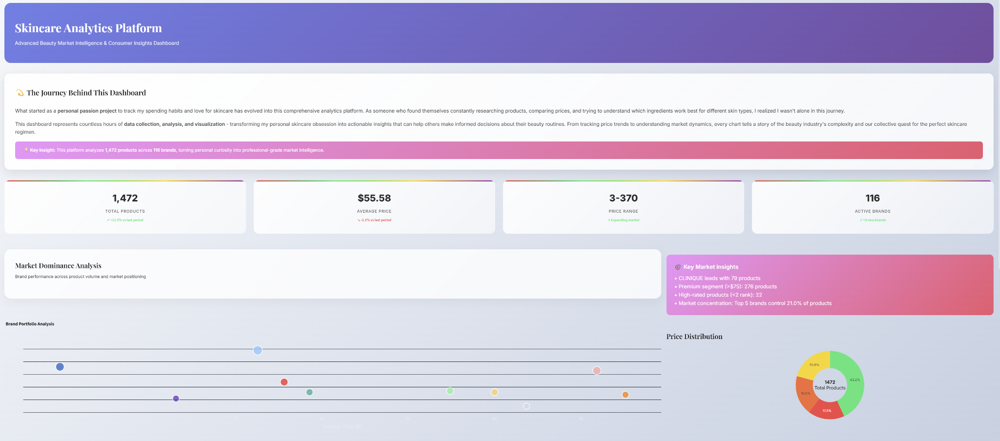
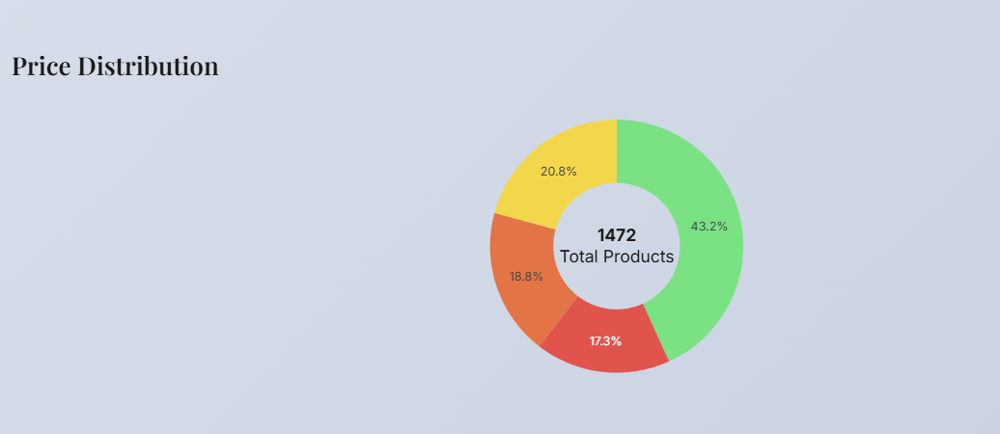

<h1 align="center">
  💄 Skincare Sales Dashboard
</h1>

<p align="center">
  
</p>

<p align="center">
  <b>A fashionable, AI-powered analytics dashboard for beauty brand insights.</b><br>
  Visualized like it’s curated by Anna Wintour herself 💅
</p>

<p align="center">
  <a href="https://skincare-analysis-vidhi-sharma.streamlit.app/">
    
  </a>
  <a href="https://github.com/VidhiSharma2000/SKINCARE-ANALYSIS">
    
  </a>
</p>

---

## ✨ Live App

▶️ [Click here to try the dashboard](https://skincare-analysis-vidhi-sharma.streamlit.app/)  
This sleek Streamlit app analyzes skincare product data with fashion-forward flair.

---

## 💎 Features

- 📊 Trendy bar, donut, and heatmap charts with **Tiffany blue**, **Vogue red**, and curated color palettes
- 🧴 KPIs showing total products, average price, and ranking spread
- 🌱 Skin-type segmentation visualized in a luxe donut pie chart
- 💅 Light, cream-colored background with Inter fonts and drop shadow styling
- ⚡️ Responsive layout and zero-lag experience

---

## 🖼️ Screenshots

<div align="center">
  <br><br>
  
  
</div>

---

## 📂 Folder Structure

```
📁 SKINCARE-ANALYSIS/
├── app.py                  # Main Streamlit dashboard
├── cosmetics.csv           # Dataset (from Kaggle)
├── requirements.txt        # For Streamlit Cloud deployment
├── images/                 # Dashboard screenshots
│   ├── dashboard_screenshot.png
│   ├── price_analysis.png
│   └── price_distribution.png
└── README.md               # This file!
```

---

## 🧠 Dataset Source

This analysis uses the `cosmetics.csv` dataset from **Kaggle**, which includes:
- Product names, brands, prices, and ranks
- Skin type suitability tags (Oily, Dry, Sensitive, etc.)

You can find the dataset [here](https://www.kaggle.com/datasets/PromptCloudHQ/ulta-beauty-products-dataset).

---

## 🚀 Run Locally

Make sure you have **Python 3.9+** installed.

```bash
git clone https://github.com/VidhiSharma2000/SKINCARE-ANALYSIS.git
cd SKINCARE-ANALYSIS
pip install -r requirements.txt
streamlit run app.py
```

---

## 🌐 Deployment

This project is deployed using [Streamlit Cloud](https://streamlit.io/cloud), and auto-updates with changes from this GitHub repo.

---

## 👩🏻‍💻 About Me

Hi! I'm **Vidhi A. Sharma** — business analyst, fashion-forward coder, and data storyteller.  
Connect with me:  
[LinkedIn](https://www.linkedin.com/in/17vidhisharma) | [GitHub](https://github.com/VidhiSharma2000)

---

## ✨ Credits

Designed with obsessive attention to color palettes by me.  
Inspired by the minimalism of Apple, the elegance of Vogue, and the sass of Glossier.

---

<p align="center">
  
</p>

